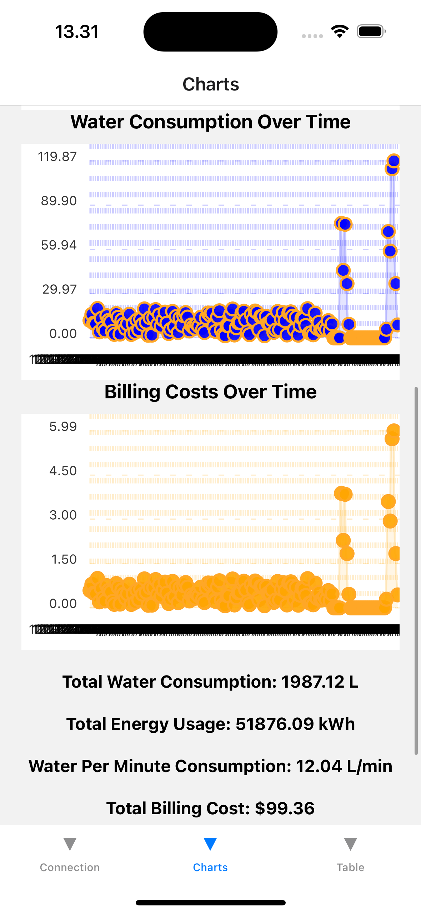

# Smart Water and Energy Consumption System

This project provides a comprehensive solution for monitoring energy and water usage. It includes features for calculating bills, analyzing consumption patterns, and displaying data through interactive charts and tables. The app is designed for residential and commercial users, providing insightful and actionable data.

## Features

### 1. **Data Display Screen**
   - Displays real-time and historical data in tabular form.
   - Data includes:
     - Flow rate (L/min)
     - Temperature (°C)
     - Timestamps
   - SqLite data is dynamically loaded and displayed.

### 2. **Graphical Analysis Screen**
   - Visual representation of:
     - Water temperature
     - Energy usage
     - Water flow rate
     - Total water consumption
     - Billing costs
   - Features:
     - Threshold marking: Highlights consumption that exceeds average daily usage (marked in red).
     - Well-structured and aesthetically pleasing charts with corrected x and y axis points.
     - Easy-to-read breakdown of pricing and key insights.

### 3. **Bill Calculation**
   - Calculates energy and water bills based on:
     - House types (e.g., detached house, terraced house).
     - Consumption patterns from SqLite data.
   - Billing calculations incorporate:
     - Fixed fees
     - Power fees
     - Reactive power fees
     - Energy taxes (categories I and II).

### 4. **Threshold Alerts**
   - Alerts users when:
     - Energy consumption exceeds normal human usage.
     - Water consumption or billing surpasses average values.
   - Enables users to monitor and adjust their usage habits.

### 5. **Dynamic Data Handling**
   - Reads SqLite data for water flow rate, temperature, and timestamps.
   - Performs calculations to generate insights for various house types.

---

## Project Structure

### Files and Folders:
1. **`TableScreen.tsx`**
   - Displays SqLite data in a table format.
   - Dynamically updates based on provided JSON input.

2. **`GraphScreen.tsx`**
   - Implements graphs for analyzing energy and water usage.
   - Includes user-friendly visual elements and thresholds.

3. **`database.ts`**
   - Handles fetching and processing of SqLite data.
   - Provides calculated insights for charts and tables.

4. **Assets**
   - SqLite data file with sample readings for testing.

### Dependencies:
- `react-native-chart-kit`: For graphical representation of data.
- `react-native`: Core framework for building UI.

---

## Minimum Information Technology (MIT) Requirements

### Hardware:
- Device with at least 4GB RAM.
- Minimum 16050MB of storage space for app installation and data.
- Android/iOS devices with versions above Android 8.0 or iOS 12.

### Software:
- Node.js for app development and dependency management.
- React Native CLI for running and debugging the app.
- Andriod Studio for andriod application 
- XCode for Ios App

### Network:
- Stable internet connection for real-time data updates (optional).

### Data:
- SqLite file containing water and energy usage data.
- Data should follow a structured format:

```SqLite Data Sample

```

---

## How to Run
1. Clone the repository.
2. Install dependencies using `npm install`.
3. Start the app with `npm start`.
4. Load the app on a device/emulator.
5. Place the JSON file in the project directory.
6. View tabular and graphical data in respective screens.
